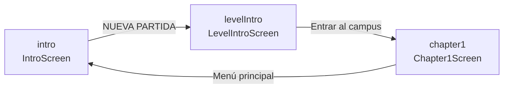

# Screen flow

Las pantallas del juego se identifican por un ID en el union `Screen` (`src/types/game.ts`). El estado actual vive en `useGameStore.currentScreen` y se navega con `setScreen('<id>')`.

## Diagrama



## Tabla de pantallas

| ID | Componente | Llega desde | Sale hacia |
|---|---|---|---|
| `intro` | `IntroScreen` | (estado inicial), `chapter1` (Menú principal) | `levelIntro` (botón NUEVA PARTIDA) |
| `levelIntro` | `LevelIntroScreen` | `intro` | `chapter1` (último diálogo: Entrar al campus) |
| `chapter1` | `Chapter1Screen` | `levelIntro` | `intro` (Menú principal); gameplay TBD |

## Cómo añadir una pantalla

1. **Tipar el ID.** Añadir al union en `src/types/game.ts`:
   ```ts
   export type Screen = 'intro' | 'levelIntro' | 'miNuevaPantalla';
   ```
2. **Crear el componente:** `src/components/screens/MiNuevaPantallaScreen.tsx` + `.css`.
3. **Registrar en el switch:** `src/components/ScreenManager.tsx`:
   ```tsx
   case 'miNuevaPantalla':
     return <MiNuevaPantallaScreen />;
   ```
4. **Conectar la navegación** desde la pantalla previa: `setScreen('miNuevaPantalla')`.
5. **Actualizar este archivo** con el nuevo nodo en el diagrama Mermaid y la tabla.

## Cómo encadenar diálogos dentro de una pantalla

Una pantalla puede tener N diálogos. Patrón estándar:

```tsx
const dialogs: DialogContent[] = [
  { speaker: { id: 'tu', label: 'TÚ', tone: 'gold' }, segments: [...] },
  { speaker: { id: 'aya', label: 'AYA', tone: 'neutral' }, segments: [...] },
  // ...
];

const [index, setIndex] = useState(0);
const isLast = index === dialogs.length - 1;

<DialogBox
  content={dialogs[index]}
  onContinue={isLast
    ? () => setScreen('siguientePantalla')
    : () => setIndex(i => i + 1)}
/>
```
